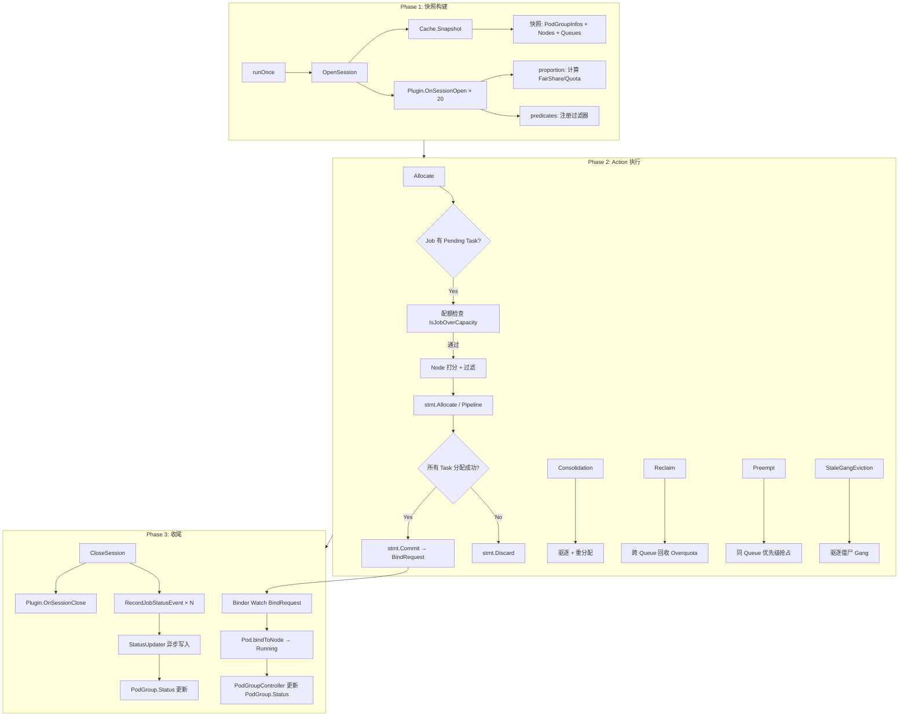

# Tutorial 05: KAI-Scheduler 调度流水线深度剖析

> **前置条件**: 你已完成 Tutorial 01–04，断点可以正常触发。
> **目标**: 彻底理解 KAI-Scheduler 内部从"收到 Pod/PodGroup"到"调度完成/回收资源"的端到端流程。

---

## 概览：三阶段模型

```
                  ┌───────────────────────────────────────────────────┐
                  │              KAI-Scheduler 调度循环                 │
                  │                                                   │
  Pod/PodGroup ──►│  Phase 1: 快照构建    (openSession + Cache.Snapshot)│
  (Informer)      │  Phase 2: Action 执行  (allocate → consolidation  │
                  │                         → reclaim → preempt       │
                  │                         → stalegangeviction)      │
                  │  Phase 3: 收尾清理    (closeSession + StatusUpdate)│
                  └───────────────────────────────────────────────────┘
```

KAI-Scheduler 的每一轮调度都是一个 **runOnce** 循环，默认每隔 `schedulePeriod` 触发一次。
每一轮循环在隔离的 **Session（快照）** 上运行，不与 Informer 实时数据竞争。

---

## Phase 1: 进入调度器后发生了什么？

### 1.1 入口：`runOnce()`

📁 **文件**: `pkg/scheduler/scheduler.go:125`

```go
func (s *Scheduler) runOnce() {
    // 1. 生成随机 SessionID
    sessionId := generateSessionID(6)

    // 2. 打开 Session（拍快照 + 注册插件）
    ssn, err := framework.OpenSession(s.cache, s.config, s.schedulerParams, sessionId, s.mux)
    defer framework.CloseSession(ssn)

    // 3. 依次执行配置中的 Actions
    actions, _ := conf_util.GetActionsFromConfig(s.config)
    for _, action := range actions {
        action.Execute(ssn)
    }
}
```

> 🔍 **断点 #1**: 设在 `scheduler.go:125` (`func (s *Scheduler) runOnce()`)
> 进入后观察 `sessionId` 和 `s.schedulePeriod`

### 1.2 快照构建：`OpenSession()`

📁 **文件**: `pkg/scheduler/framework/framework.go:32`

OpenSession 做两件事：

#### (a) 拍摄集群快照

```go
ssn, err := openSession(cache, sessionId, *schedulerParams, mux)
```

内部调用 `cache.Snapshot()` (`pkg/scheduler/cache/cache.go:189`)，返回 `ClusterInfo`：

| 快照字段 | 含义 |
|---------|------|
| `snapshot.PodGroupInfos` | 所有 PodGroup（即"Job"）及其关联的 Pod |
| `snapshot.Nodes` | 所有 Node 的资源信息（Idle/Used/Releasing） |
| `snapshot.Queues` | 所有 Queue 的配额信息 |
| `snapshot.QueueResourceUsage` | Queue 历史使用量（来自 UsageDB） |
| `snapshot.ConfigMaps` | 相关配置 |
| `snapshot.Topologies` | 拓扑约束 |

> 🔍 **断点 #2**: 设在 `framework/session.go:365` (`cache.Snapshot()`)
> 检查 `snapshot.PodGroupInfos` 的长度，确认你的 TrainJob 是否已被"看到"。

#### (b) 注册所有插件

```go
for _, tier := range config.Tiers {
    for _, pluginOption := range tier.Plugins {
        plugin := pb(pluginOption.Arguments)
        plugin.OnSessionOpen(ssn)   // ← 插件在此注册回调
    }
}
```

默认配置定义了 **20 个插件**（见 `pkg/scheduler/conf_util/scheduler_conf_util.go:36`）：

```yaml
actions: "allocate, consolidation, reclaim, preempt, stalegangeviction"
tiers:
- plugins:
  - name: predicates       # Node 过滤
  - name: proportion       # Queue 配额与公平分享
  - name: priority         # Job 优先级排序
  - name: elastic          # 弹性 Job（minAvailable < replicas）
  - name: kubeflow         # Kubeflow MPIJob/PyTorchJob 适配
  - name: ray              # Ray Job 适配
  - name: nodeavailability # Node 可用性检查
  - name: gpusharingorder  # GPU 共享排序
  - name: gpupack          # GPU 打包策略
  - name: resourcetype     # 资源类型匹配
  - name: subgrouporder    # SubGroup 排序
  - name: taskorder        # Task 排序
  - name: nominatednode    # 已提名 Node 优先
  - name: dynamicresources # DRA 动态资源
  - name: nodeplacement    # Node 放置策略 (binpack/spread)
    arguments:
      cpu: binpack
      gpu: binpack
  - name: minruntime       # 最小运行时间保护
  - name: topology         # 拓扑感知调度
```

其中 **`proportion` 插件** 在 `OnSessionOpen` 中完成了最关键的计算：

1. **统计集群总资源** → `setTotalResources()`
2. **创建 Queue 资源属性** → `createQueueAttributes()` → 设置 Quota/Limit/OverQuotaWeight
3. **计算公平分享(FairShare)** → `setFairShare()` → 按权重分配
4. **注册配额检查回调** → `IsJobOverQueueCapacity`, `IsNonPreemptibleJobOverQuota` 等

> 🔍 **断点 #3**: 设在 `plugins/proportion/proportion.go:98` (`OnSessionOpen`)
> 观察 `pp.totalResource` 和 `pp.queues` 的内容

---

## Phase 2: 执行过程中发生了什么？

### 2.1 Action 执行顺序

默认 5 个 Action 按顺序执行（`pkg/scheduler/actions/factory.go:31`）：

```
┌──────────────┐    ┌───────────────┐    ┌─────────┐    ┌──────────┐    ┌────────────────────┐
│  1. allocate │───▶│ 2. consolidat │───▶│3. reclaim│───▶│4. preempt│───▶│5. stalegangeviction│
│   (分配)      │    │   ion (整合)   │    │  (回收)  │    │  (抢占)   │    │    (僵尸驱逐)        │
└──────────────┘    └───────────────┘    └─────────┘    └──────────┘    └────────────────────┘
```

### 2.2 Action 1: Allocate（分配）— 主要调度路径

📁 **文件**: `pkg/scheduler/actions/allocate/allocate.go:46`

这是最核心的 Action，负责将 Pending 的 Job 分配到 Node 上。

#### 流程分解

```
Allocate.Execute(ssn)
  │
  ├─ 1. 构建优先级队列 JobsOrderByQueues
  │     • 过滤: 只保留有 Pending Task 的 Job
  │     • 过滤: 只保留 Ready 的 Job
  │     • 排序: Queue 优先级 → Job 优先级 → CreationTime
  │
  ├─ 2. for !jobsOrderByQueues.IsEmpty() {
  │     job := jobsOrderByQueues.PopNextJob()  ← 按优先级弹出
  │     │
  │     └─ attemptToAllocateJob(ssn, stmt, job)
  │          │
  │          ├─ 3. 配额检查: IsJobOverQueueCapacityFn
  │          │   → proportion 插件检查 Queue 的 Allocated + Request 是否超过 Limit
  │          │   → 如果超限，设置 FitError 并返回 false
  │          │
  │          ├─ 4. 分配子组: allocateSubGroupSet → allocatePodSet → allocateTasksOnNodeSet
  │          │     │
  │          │     └─ for each task in tasksToAllocate:
  │          │          │
  │          │          ├─ 4a. PrePredicateFn (预过滤)
  │          │          │   → 例如 dynamicresources, podaffinity 的全局预检
  │          │          │
  │          │          ├─ 4b. OrderedNodesByTask (Node 打分排序)
  │          │          │   → NodePreOrderFn (预排序回调)
  │          │          │   → NodeOrderFn (并行打分)
  │          │          │   → 按分数降序排列节点
  │          │          │
  │          │          ├─ 4c. FittingNode (Node 过滤)
  │          │          │   ├─ isTaskAllocatableOnNode  (资源量检查)
  │          │          │   └─ PredicateFn              (K8s 原生 Predicates)
  │          │          │       → Node Affinity/Anti-Affinity
  │          │          │       → Toleration/Taint
  │          │          │       → PodTopologySpreadConstraints
  │          │          │       → ...
  │          │          │
  │          │          └─ 4d. allocateTaskToNode
  │          │               ├─ 整数 GPU → stmt.Allocate(task, node)
  │          │               ├─ 分数 GPU → gpu_sharing.AllocateFractionalGPU...
  │          │               └─ Pipeline  → stmt.Pipeline(task, node)
  │          │
  │          └─ 5. 如果 Job 需要 Pipeline（部分 Task 在 Releasing Node 上）
  │               → stmt.ConvertAllAllocatedToPipelined
  │
  └─ 6. stmt.Commit() 或 stmt.Discard()
        │
        ├─ Commit: 对每个 Operation 调用实际 API
        │   ├─ allocate → ssn.BindPod → Cache.Bind → 创建 BindRequest CR
        │   ├─ pipeline → Cache.TaskPipelined → 更新状态
        │   └─ evict    → Cache.Evict → 驱逐 Pod
        │
        └─ Discard: 回滚所有 Session 内的变更
```

> 🔍 **断点 #4**: 设在 `actions/allocate/allocate.go:60` (`job := jobsOrderByQueues.PopNextJob()`)
> 检查弹出的 Job 是否是你的 TrainJob

> 🔍 **断点 #5**: 设在 `actions/common/allocate.go:137-138` (`ssn.FittingNode`)
> 跟踪 Task 在每个 Node 上的适配结果

#### Statement：事务性调度的关键

📁 **文件**: `pkg/scheduler/framework/statement.go`

Statement 是 KAI-Scheduler 实现**事务性调度**的核心，类似数据库事务：

```
Statement
  ├─ operations []Operation   ← 记录所有操作（Allocate/Pipeline/Evict）
  ├─ Checkpoint()             ← 保存检查点
  ├─ Rollback(cp)             ← 回滚到检查点
  ├─ Commit()                 ← 提交所有操作到 API Server
  └─ Discard()                ← 丢弃所有操作
```

**三种操作类型**:

| 操作 | Session 内行为 | Commit 时行为 |
|------|--------------|-------------|
| `Allocate` | 更新 Task 状态为 Allocated，扣减 Node 资源 | 创建 BindRequest CR → Binder 执行实际绑定 |
| `Pipeline` | 更新 Task 状态为 Pipelined，预留 Node 资源 | 标记 Pod 为 Pipelined（等待 Releasing 资源释放） |
| `Evict` | 更新 Task 状态为 Releasing，释放 Node 资源 | 调用 K8s Eviction API 驱逐 Pod |

### 2.3 Action 2: Consolidation（资源整合）

📁 **文件**: `pkg/scheduler/actions/consolidation/consolidation.go:32`

目标：**在不增加集群总资源使用的情况下，通过移动低优先级 Job 来为高优先级 Job 腾出整块资源**。

```
场景：
  Node A:  [Job-X: 4 GPU (preemptible)]  [空闲: 0 GPU]
  Node B:  [Job-Y: 2 GPU (preemptible)]  [空闲: 2 GPU]

  新 Job-Z 需要 4 GPU，没有单节点满足。

Consolidation 策略：
  1. 驱逐 Node B 的 Job-Y → Node B 空出 4 GPU
  2. 分配 Job-Z 到 Node B
  3. 重新分配 Job-Y 到 Node A 或 B 的剩余空间
```

关键约束：`allPodsReallocated` — 所有被驱逐的 victim 必须能重新分配到其他节点。

### 2.4 Action 3: Reclaim（跨 Queue 配额回收）

📁 **文件**: `pkg/scheduler/actions/reclaim/reclaim.go:47`

目标：**当一个 Queue 超用了配额（overquota），另一个 Queue 有配额内的未满足需求时，回收超用的资源**。

```
场景：
  Queue A: Quota=4 GPU, Allocated=8 GPU (overquota, 有 preemptible jobs)
  Queue B: Quota=4 GPU, Allocated=0 GPU, Pending Job 需要 4 GPU

Reclaim 策略：
  1. Queue B 的 Job 通过 CanReclaimResources 检查
  2. 在 Queue A 中找到 preemptible victims
  3. 驱逐 Queue A 的 victims，将资源分配给 Queue B 的 Job
```

关键函数：
- `CanReclaimResources` → proportion 插件判断 reclaimer 的 Queue 是否有"可回收权"
- `ReclaimVictimFilter` → 过滤 victim（必须是不同 Queue 的 preemptible Job）
- `ReclaimScenarioValidatorFn` → 验证回收方案是否合法

> 🔍 **断点 #6**: 设在 `actions/reclaim/reclaim.go:65` (`ssn.CanReclaimResources(job)`)
> 当断点触发时检查 Queue 的 allocated vs quota

### 2.5 Action 4: Preempt（同 Queue 内抢占）

📁 **文件**: `pkg/scheduler/actions/preempt/preempt.go:46`

目标：**在同一 Queue 内，高优先级 Job 抢占低优先级 Job 的资源**。

```
关键约束：
  1. victim.Priority < preemptor.Priority   ← 只能抢占更低优先级
  2. victim.Queue == preemptor.Queue        ← 只在同一 Queue 内
  3. victim.IsPreemptibleJob() == true      ← victim 必须可被抢占
  4. victim 有 Active Allocated Tasks       ← victim 必须有正在运行的 Pod
```

与 Reclaim 的核心区别：

| 维度 | Reclaim | Preempt |
|------|---------|---------|
| 范围 | 跨 Queue | 同 Queue |
| 依据 | 配额(Quota) | 优先级(Priority) |
| Victim 来源 | 其他 Queue 的 overquota Job | 同 Queue 的低优先级 Job |

### 2.6 Action 5: StaleGangEviction（僵尸 Gang 驱逐）

📁 **文件**: `pkg/scheduler/actions/stalegangeviction/stalegangeviction.go:29`

目标：**驱逐"僵尸"Gang Job** — 即 Gang Job 没有满足 minAvailable 要求，已运行的 Pod 被标记为 Stale。

```
场景：
  Job X: minAvailable=4, 但只有 2 个 Pod Running
  经过 GlobalDefaultStalenessGracePeriod 后 → 标记为 Stale
  → 驱逐已运行的 2 个 Pod，释放资源
```

这是一个清理机制，防止部分 Running 的 Gang Job 长期占用资源。

---

## Phase 3: 执行结束后发生了什么？

### 3.1 关闭 Session：`CloseSession()`

📁 **文件**: `pkg/scheduler/framework/framework.go:67`

```go
func CloseSession(ssn *Session) {
    // 1. 通知所有插件 Session 结束
    for _, plugin := range ssn.plugins {
        plugin.OnSessionClose(ssn)
    }

    // 2. 真正关闭 Session
    closeSession(ssn)
}
```

`closeSession` (`session.go:383`) 做了一件关键的事：

```go
func closeSession(ssn *Session) {
    // 将所有 Job 的状态推入 StatusUpdater 通道
    for _, job := range ssn.PodGroupInfos {
        ssn.Cache.RecordJobStatusEvent(job)
    }

    ssn.clear()
    ssn.Cache.WaitForWorkers(stopCh)  // 等待所有异步 worker 完成
}
```

### 3.2 状态更新：BindRequest → Binder → Pod Running

当 `stmt.Commit()` 中的 `commitAllocate` 被调用时：

```
commitAllocate(task)
  └─ ssn.BindPod(task)
       └─ Cache.Bind(podInfo, hostname, annotations)
            ├─ StatusUpdater.PreBind(pod)        ← 更新 Pod condition
            ├─ createBindRequest(podInfo, node)  ← 创建 BindRequest CR
            └─ StatusUpdater.Bound(pod, node)    ← 更新 Pod labels/conditions
```

**BindRequest** 是 KAI-Scheduler 特有的 CRD（`scheduling.run.ai/v1alpha2`），包含：

```yaml
apiVersion: scheduling.run.ai/v1alpha2
kind: BindRequest
metadata:
  name: <pod-name>
  namespace: <namespace>
  ownerReferences:
  - apiVersion: v1
    kind: Pod
    name: <pod-name>
spec:
  podName: <pod-name>
  selectedNode: <node-name>
  selectedGPUGroups: ["0", "1"]        # GPU 分配
  receivedResourceType: "gpu"
  receivedGPU:
    count: 2
    portion: "1.00"
```

**Binder 组件** (`cmd/binder/`) 是独立的控制器，Watch BindRequest 并执行：
1. 读取 BindRequest
2. 将 GPU 分配信息写入 Pod Annotation
3. 调用 K8s API `pod.bindToNode(hostname)`
4. Pod 变为 `Scheduled` → kubelet 启动容器 → `Running`

### 3.3 PodGroup 状态：PodGroupController

📁 **文件**: `pkg/podgroupcontroller/controllers/pod_group_controller.go:55`

PodGroupController 是一个独立的 Reconciler，Watch Pod 和 PodGroup 的变化：

```go
func (r *PodGroupReconciler) Reconcile(ctx, req) (ctrl.Result, error) {
    podGroup := r.getPodGroupObject(ctx, req)
    return r.handlePodGroupStatus(ctx, podGroup)
}
```

`handlePodGroupStatus` 流程：

```
handlePodGroupStatus(ctx, podGroup)
  │
  ├─ 1. 获取 PodGroup 关联的所有 Pod
  │     cluster_relations.GetAllPodsOfPodGroup()
  │
  ├─ 2. 计算 PodGroup 元数据
  │     calculatePodGroupMetadata()
  │     ├─ Preemptible 标志
  │     ├─ Requested 资源 = Σ(Active Pod 的 Requests)
  │     └─ Allocated 资源 = Σ(Running/Scheduled Pod 的 Requests)
  │
  └─ 3. 更新 PodGroup Status
        updateStatusIfNecessary()
        └─ PodGroup.Status.ResourcesStatus:
             ├─ Requested: {...}
             ├─ Allocated: {...}
             └─ AllocatedNonPreemptible: {...}  (如果非 preemptible)
```

### 3.4 Pod 完成/失败后的资源回收

资源回收是**被动的**，不需要调度器主动介入：

```
Pod 完成/失败
  │
  ├─ 1. kubelet 将 Pod Phase 设为 Succeeded/Failed
  │
  ├─ 2. Cache Informer 检测到 Pod 变化
  │     → 从 ClusterInfo 中移除该 Pod
  │     → Node 的 Used 资源减少，Idle 资源增加
  │
  ├─ 3. 下一轮 runOnce() 的 Snapshot 中
  │     → Node 显示有更多空闲资源
  │     → PodGroup 的 Pending 计数可能变化
  │
  ├─ 4. PodGroupController 检测 Pod Phase 变化
  │     → 重新计算 PodGroup 的 Allocated/Requested
  │     → 如果所有 Pod 完成 → PodGroup 的 Allocated = 0
  │
  └─ 5. 如果 Gang Job 部分 Pod 失败
        → StaleGangEviction Action 可能驱逐剩余 Pod
        → 资源完全释放
```

---

## 完整调度流水线总结



---

## IDE 断点路线图

按以下顺序设置断点，跟着一轮 `runOnce()` 走完整个流程：

| 序号 | 文件 | 行/函数 | 观察内容 |
|------|------|---------|---------|
| BP1 | `scheduler.go:125` | `runOnce()` | SessionID, schedulePeriod |
| BP2 | `framework.go:41` | `openSession()` | 快照内容: Jobs/Nodes/Queues 数量 |
| BP3 | `proportion.go:98` | `OnSessionOpen` | `pp.totalResource`, Queue FairShare |
| BP4 | `allocate.go:60` | `PopNextJob()` | 弹出的 Job 名称和 Queue |
| BP5 | `common/allocate.go:26` | `IsJobOverQueueCapacityFn` | 配额检查结果 |
| BP6 | `common/allocate.go:136` | `OrderedNodesByTask` | Node 排序分数 |
| BP7 | `common/allocate.go:138` | `FittingNode` | Node 过滤结果 |
| BP8 | `common/allocate.go:174` | `stmt.Allocate` | 绑定的 Task 和 Node |
| BP9 | `statement.go:519` | `Commit()` | 提交的 Operation 列表 |
| BP10 | `cache.go:277` | `Bind()` | BindRequest 创建 |
| BP11 | `session.go:388` | `closeSession` → `RecordJobStatusEvent` | Job 最终状态 |

---

## 关键概念速查

### Queue 配额体系

```
Queue "team-a"
  ├─ Quota (保障配额):     4 GPU   ← 保证可用
  ├─ OverQuotaWeight:     2       ← 超用权重（与其他 Queue 竞争）
  ├─ Limit (硬上限):       8 GPU   ← 绝对不能超过
  ├─ FairShare (公平分享):  计算得出  ← 根据集群总资源 + 权重推导
  ├─ Allocated:           当前已分配
  └─ Request:             当前请求（含 Pending）
```

### Pod 状态流转

```
Pending ──[Allocate]──► Allocated ──[Commit/Bind]──► Binding ──► Running
  │                        │                                       │
  │    ┌──[Pipeline]──► Pipelined                                  │
  │    │                   │                                       │
  └────┘              (等待 Releasing                         [完成/失败]
                       资源释放后                                  │
                       → Allocated)                              ▼
                                                            Succeeded/Failed
                                      ◄──[Evict]──── Releasing
```

### Gang 调度

KAI-Scheduler 原生支持 Gang 调度：
- **PodGroup.MinMember** (或 SubGroup.MinAvailable): 最少需要同时运行的 Pod 数量
- 如果无法满足 minAvailable → 整个 Job 不会被调度（all-or-nothing）
- 如果已运行的 Pod 数量 < minAvailable 且超过宽限期 → StaleGangEviction 清理

---

## 下一步

- **Tutorial 06**: 端到端调试排障指南 — 从七个 Bug 到鸢尾花绽放
- 练习: 在集群中创建 2 个 Queue，提交超过配额的 Job，观察 Reclaim 行为
- 练习: 提交一个 minAvailable=3 的 Gang Job 到只有 2 个 Node 的集群，观察 StaleGangEviction

