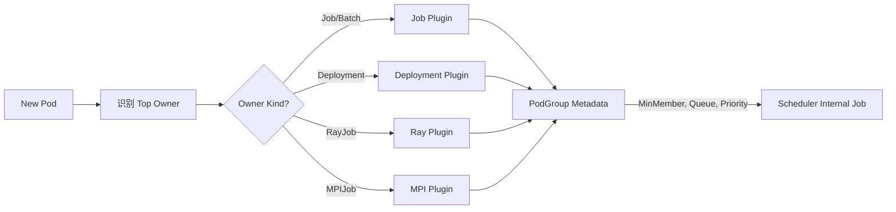

# Pod Grouper 走读

本文梳理 KAI Scheduler 的 **Pod Grouper** 组件：它如何将 Kubernetes 的 Pod 映射为调度器内部的 Job (PodGroup) 概念，以及如何通过插件机制自定义分组逻辑。

参考文档：`docs/developer/pod-grouper-zh.md`。

---

## 1. 核心概念：为什么需要 Pod Grouper？

KAI Scheduler 是面向 Batch/AI 负载的调度器，其核心调度单元是 **Job (PodGroup)** 而非单个 Pod。

- **Gang Scheduling**：AI 训练任务通常需要一组 Pod 同时就绪才能运行。
- **Pod Group**：逻辑上的“任务组”，包含 `MinMember`（最小成员数）、`Queue`（所属队列）、`Priority`（优先级）等元数据。

**Pod Grouper** 的职责就是：

1. 监听新 Pod。
2. 找到该 Pod 的 **Top Owner**（例如 Deployment, Job, MPIJob, RayJob 等）。
3. 根据 Owner 类型，调用对应的 **Plugin**。
4. 生成 `PodGroup` 对象（包含元数据）。



---

## 2. 核心接口与流程

代码路径：`pkg/podgrouper/podgrouper/podgrouper.go`

### 2.1 接口定义

```go
type Interface interface {
    // 1. 向上追溯 OwnerReferences 找到 Top Owner (e.g. Pod -> ReplicaSet -> Deployment)
    GetPodOwners(ctx context.Context, pod *v1.Pod) (*unstructured.Unstructured, []*metav1.PartialObjectMetadata, error)

    // 2. 调用插件计算元数据
    GetPGMetadata(ctx context.Context, pod *v1.Pod, topOwner *unstructured.Unstructured, allOwners []*metav1.PartialObjectMetadata) (*podgroup.Metadata, error)
}
```

### 2.2 核心实现 (`podGrouper`)

- **GetPodOwners**:
  - 这是一个递归或循环查找过程。
  - 读取 `pod.OwnerReferences`。
  - 如果 Owner 还有 Owner，继续向上查，直到没有 Owner 或 Owner 是被视为 Top 的资源。
  - **关键点**：处理各种权限错误和 Edge Case（如 Owner 已删）。

- **GetPGMetadata**:
  - 利用 `pluginsHub` 根据 `Top Owner` 的 `GVK` (GroupVersionKind) 找到注册的 Plugin。
  - 调用 Plugin 的 `GetPodGroupMetadata` 方法。

```go
func (pg *podGrouper) GetPGMetadata(...) (*podgroup.Metadata, error) {
    ownerKind := metav1.GroupVersionKind(topOwner.GroupVersionKind())
    // 路由到对应插件
    plugin := pg.pluginsHub.GetPodGrouperPlugin(ownerKind)
    return plugin.GetPodGroupMetadata(topOwner, pod, allOwners...)
}
```

---

## 3. 默认实现：Default Grouper

代码路径：`pkg/podgrouper/podgrouper/plugins/defaultgrouper/default_grouper.go`

几乎所有的特定 CRD Grouper（如 Ray, Job, Kubeflow）都**组合（Embed）**了 `DefaultGrouper`，只在需要特殊逻辑时覆盖特定方法。

### 3.1 元数据计算逻辑

`DefaultGrouper` 提供了通用的元数据提取逻辑：

| 元数据             | 来源逻辑 (优先级从高到低)                                                                                                                                                      |
| :----------------- | :----------------------------------------------------------------------------------------------------------------------------------------------------------------------------- |
| **Name**           | `pod-group-{OwnerName}-{OwnerUID}` （确保唯一性）                                                                                                                              |
| **Queue**          | 1. Owner Label `kai.scheduler/queue`<br>2. Pod Label `kai.scheduler/queue`<br>3. Project Label + NodePool Label<br>4. Default Queue                                            |
| **Priority**       | 1. Owner/Pod Label `kai.scheduler/priority`<br>2. `Pod.Spec.PriorityClassName`<br>3. ConfigMap 映射 (`WorkloadType` -> `PriorityClass`)<br>4. Default (`Train` 或 `Inference`) |
| **MinMember**      | 默认为 **1** (普通 Pod 或 Service 不需要 Gang 调度)                                                                                                                            |
| **Preemptibility** | Owner/Pod Label `kai.scheduler/preemptibility` (true/false)                                                                                                                    |

### 3.2 关键代码片段：Queue 计算

```go
func (dg *DefaultGrouper) CalcPodGroupQueue(topOwner *unstructured.Unstructured, pod *v1.Pod) string {
    // 1. 尝试直接从 Label 获取队列名
    if queue, found := topOwner.GetLabels()[dg.queueLabelKey]; found {
        return queue
    }
    // ...

    // 2. 尝试根据 Project + NodePool 计算
    // 逻辑：{project}-{nodepool}
    queue := dg.calculateQueueName(topOwner, pod)

    // 3. Fallback
    return constants.DefaultQueueName
}
```

---

## 4. 如何扩展：编写一个新的 Grouper 插件

如果你需要支持一个新的 CRD（例如自定义的 `MyBigDataJob`），并希望它支持 Gang Scheduling（即 `MinMember > 1`）：

### 步骤 1：创建 Plugin

通常组合 `DefaultGrouper` 并重写 `GetPodGroupMetadata`。

```go
type MyJobGrouper struct {
    *defaultgrouper.DefaultGrouper
}

func (g *MyJobGrouper) GetPodGroupMetadata(...) (*podgroup.Metadata, error) {
    // 1. 获取默认元数据
    meta, _ := g.DefaultGrouper.GetPodGroupMetadata(...)

    // 2. 从 CRD 的 Spec 中提取 minMember
    // 假设 MyBigDataJob.Spec.Replicas 是并发数
    replicas, _, _ := unstructured.NestedInt64(topOwner.Object, "spec", "replicas")

    // 3. 设置 Gang 约束
    meta.MinAvailable = int32(replicas)

    return meta, nil
}
```

### 步骤 2：注册 Plugin

在 `pkg/podgrouper/podgrouper/hub/hub.go` (假设位置) 或初始化代码中注册：

```go
// 伪代码
hub.Register(schema.GroupVersionKind{Group: "my.io", Kind: "MyBigDataJob"}, NewMyJobGrouper(defaultGrouper))
```

---

## 5. 常见插件一览

在 `pkg/podgrouper/podgrouper/plugins/` 目录下可以看到各种内置支持：

- **deployment**: `MinMember = 1`，通常用于在线服务。
- **job** (K8s Batch Job): `MinMember = 1` (除非并行度特定设置)，通常用于简单批处理。
- **kubeflow (pytorch/tf/mpi)**:
  - 能够解析 `Spec.PyTorchReplicaSpecs` 等字段。
  - **核心价值**：自动计算 `MinMember = Sum(Workers + Masters)`，无需用户手动在这个 CRD 上打标。
- **ray**: 支持 RayCluster, RayJob 的拓扑和成员计算。

---

## 6. 总结

Pod Grouper 是 KAI Scheduler 能够“看懂”各种上层 AI/BigData 框架 CRD 的关键适配层。

- **输入**：K8s Pod + Owner References。
- **输出**：PodGroup (Queue, Priority, MinMember)。
- **核心机制**：Top Owner 识别 + 针对 Kind 的 Plugin 映射。
- **默认行为**：通过 Label (`kai.scheduler/queue`) 传递队列信息，通过 Label 控制优先级。

在二开场景中，如果引入了新的作业类型 CRD，且需要特殊的 Gang 调度逻辑（比如 MinMember 动态计算），则必须开发对应的 Pod Grouper Plugin。
