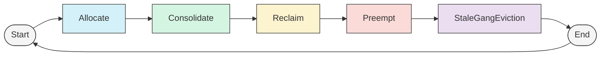

# 调度器动作框架

## 概述
调度器采用基于动作的系统来做出调度决策。从高层次来看，动作会生成[场景](#1-场景)，这些场景在通过 [statement](#3-statement) 提交到集群之前会经过[模拟](#2-模拟)和验证。这使得复杂的调度逻辑得以实现，同时保持一致性，并允许回滚失败的操作，而无需不必要地中断 Pod。

有关动作如何融入更广泛的调度器架构的概述，请参阅[调度器核心概念](scheduler-concepts.md)。

## 调度动作

1. **Allocate（分配）**
   - 主要动作，尝试将待调度的 Pod 分配到可用节点
   - 使用评分函数寻找 Pod 的最优放置位置
   - 首先执行，以处理无需干扰即可调度的 Pod

2. **Consolidate（整合）**
   - 整合工作负载以最小化资源碎片化
   - 将 Pod 从负载较轻的节点迁移，以更好地利用集群资源
   - 改善装箱效率和能源效率
   - 在基本分配之后执行，以优化现有放置
   - 除非所有被驱逐的 Pod 都有可重新放置的位置，否则不会提交场景

3. **Reclaim（回收）**
   - 在不同队列之间回收借用的资源
   - 力求集群资源的公平分配（根据插件限制）

4. **Preempt（抢占）**
   - 对队列内作业进行优先级排序
   - 驱逐较低优先级的队列内作业，以支持较高优先级的作业（根据插件限制）

5. **StaleGangEviction（过期 Gang 驱逐）**
   - 驱逐违反其 minMember gang 要求的作业
   - 通过强制执行 gang 调度来防止集群死锁
   - 允许宽限期让作业恢复其 gang 要求

### 动作执行顺序

动作按特定顺序执行，旨在最小化干扰：



1. **Allocate** - 首先尝试常规调度，无干扰
2. **Consolidate** - 优化放置，无永久性驱逐
3. **Reclaim** - 在队列之间回收资源借用
4. **Preempt** - 同一队列内作业的基于优先级的抢占
5. **StaleGangEviction** - 清理运行 Pod 数量不足的 gang 作业，以防止集群死锁

此顺序确保仅在必要时执行破坏性操作，并优先尝试干扰最小的选项。

## 核心概念

### 1. 场景（Scenarios）

场景表示假设的调度状态，用于建模和评估潜在的调度决策。

**关键组件：**
- **ByNodeScenario**：跨节点的潜在 Pod 放置快照
- **PodAccumulatedScenarioBuilder**：逐步构建更复杂的场景
- **Scenario Filters（场景过滤器）**：根据约束验证场景。用作优化，以便在执行耗时的模拟之前尽早排除场景

场景使调度器能够：
- 建模假设的放置情况
- 评估潜在变更后的资源可用性
- 在提交之前测试复杂的调度操作

### 2. 模拟（Simulation）

模拟用于检查潜在的调度决策。例如，在驱逐某些受害作业以允许另一个作业被调度之前，我们希望确保根据所有调度考虑因素（例如：可用资源、Pod/节点亲和性、节点上卷/动态资源的可用性、队列公平份额、队列限制等）分配将成功。
调度器可以在内存中执行虚拟调度决策，例如 Pod 的分配或驱逐，并检查结果。插件可以注册这些操作的回调，以跟踪集群状态的虚拟变化。如果调度器认为一组分配不可取，可以部分或完全回滚。

### 3. Statement

Statement 对象表示类似事务的调度操作分组，可以作为一个单元提交或回滚。Statement 用于模拟调度场景，而无需将其提交到集群。

**关键能力：**
- **Checkpoint/Rollback（检查点/回滚）**：创建回滚点以防操作失败
- **Operation Tracking（操作跟踪）**：维护有序的操作列表
- **Resource Consistency（资源一致性）**：在操作期间管理资源记账

重要操作：
```go
stmt.Checkpoint()          // 创建回滚点
stmt.Rollback(checkpoint)  // 返回到之前的状态
stmt.Allocate(pod, node)   // 虚拟地将 Pod 分配到节点
stmt.Evict(pod, msg)      // 虚拟地从节点驱逐 Pod
stmt.Pipeline(pod, node)  // 将 Pod 管道到节点（在待驱逐资源上分配）
stmt.Commit()              // 将所有更改应用到集群
stmt.Discard()             // 丢弃所有更改
```

本文档涵盖了调度器动作框架的主要概念。有关特定实现或高级功能的更多详细信息，请参阅代码库和测试。欢迎提出请求和建议。
