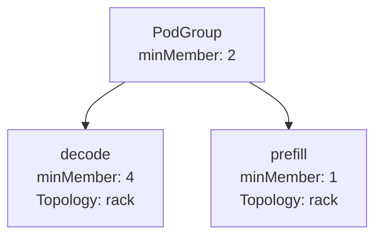
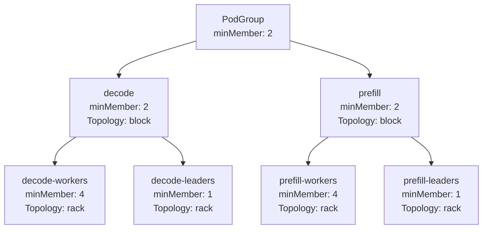
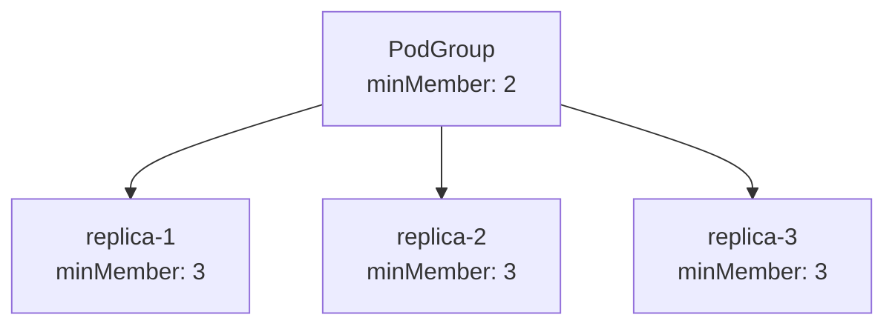
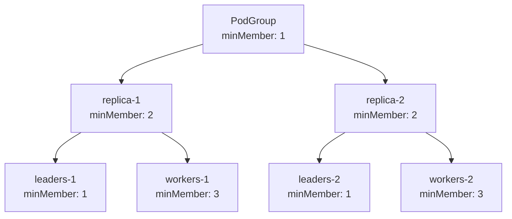

# 层次化 PodGroup 结构

## 概述
本文档概述了对 PodGroup 架构的增强，通过在 PodGroup 内引入 SubGroup，实现对工作负载内 Pod 子集的 gang 调度和拓扑感知放置的细粒度控制。PodGroup 继续为整个工作负载强制执行 gang 调度，此扩展允许工作负载为各个 SubGroup 指定 minMember 和拓扑约束，从而对较小 Pod 组的放置和调度方式提供更精细的控制。例如，SubGroup 可以指定其 Pod 子集必须一起调度（minMember），并定义与该子集需求相符的特定网络拓扑约束。此设计在保持原子化工作负载调度语义的同时，实现了与拓扑感知调度策略紧密契合的高级、细粒度放置策略。

## 动机
现代推理工作负载由具有不同网络敏感性和资源需求的组件组成，需要在 gang 调度工作负载的上下文中表达细粒度调度和放置偏好。PodGroup 级别的统一约束可能施加过于严格的放置要求，无法满足不同工作负载组件的细微需求。通过在 PodGroup 内引入 SubGroup，工作负载可以为每个 SubGroup 指定 minMember 要求和拓扑约束，同时保持整体 gang 调度语义。这实现了高级放置策略，提高了调度灵活性和效率，并确保可以在不损害工作负载原子调度保证的情况下表达差异化放置和子组级 gang 约束。

## 目标
- 实现细粒度调度规范：允许 PodGroup 定义较小 Pod SubGroup 的调度方式，为每个 SubGroup 指定 minMember 和拓扑约束。
- 在保持灵活性的同时保持原子性：在工作负载级别保持 gang 调度语义，同时启用每个 SubGroup 的约束，对 Pod 子集进行细粒度控制。
- 支持高级拓扑感知放置：允许 PodGroup 内的 SubGroup 定义特定拓扑约束，以实现集群内的精确放置。
- 增强与工作负载一致性的资源利用：通过支持差异化放置策略而不施加过于严格的统一约束，提高集群利用率。
- 保持向后兼容性：确保使用不带 SubGroup 的 PodGroup 的现有工作负载无需修改即可继续工作。

## 非目标
- 部分工作负载执行：本设计不支持在满足 PodGroup 的 gang 调度条件之前独立执行 Pod 子集。
- 拓扑发现与优化：本设计不包含拓扑发现或自动拓扑优化的增强。
- Pod 级别调度的变更：此增强不会改变 Pod 级别调度机制，仅会应用 PodGroup 上下文中的 SubGroup minMember 和拓扑约束。

## 用户故事

### 用户故事 1：细粒度 Gang 调度
我希望指定一个需要 10 个 Pod 原子调度的 PodGroup，同时定义 decode-workers SubGroup 需要至少 4 个 Pod 作为 gang 调度，以实现工作负载架构的更好资源对齐。

### 用户故事 2：SubGroup 特定拓扑约束
我希望一个 SubGroup 放置在同一机架内以实现低延迟，同时允许另一个 SubGroup 的 Pod 在集群中灵活放置，使网络敏感组件与工作负载需求保持一致。

### 用户故事 3：具有同置 Leader 和 Worker 的多 SubGroup 工作负载
我希望定义 decode-leaders、decode-workers、prefill-leaders 和 prefill-workers SubGroup，其中 leader 和 worker 在每个组内同置，但 prefill 和 decode 组可以在不同位置调度以优化资源放置。

### 用户故事 4：多副本工作负载的最小副本阈值
我希望定义一个包含同一工作负载多个副本的 PodGroup，并要求在工作负载启动之前 gang 调度最小数量的副本。超过此阈值后，调度器应在资源可用时机会性地调度额外副本。

### 用户故事 5：具有 Gang 调度的自动扩缩 SubGroup 集
我希望定义可以自动扩缩的特定 SubGroup 集，以便在扩缩发生时，这些集内的 SubGroup 的新副本会被创建。我希望每个副本作为 gang 调度，但只需要至少一个副本即可开始运行，在保持 gang 语义的同时确保弹性。

### 用户故事 6：向后兼容性
我希望我现有的不带 SubGroup 的 PodGroup 无需修改即可继续工作，确保高级调度能力的无缝迁移路径。

## 设计提案
本提案扩展 PodGroup CRD 和调度流程，在 PodGroup 内引入 SubGroup，使工作负载能够为 Pod 子集定义细粒度 gang 调度（minMember）和拓扑约束，同时在工作负载级别保持 gang 调度语义。

## 关键概念
- PodGroup 表示使用 gang 调度原子调度的作业。
  - PodGroup 被划分为不同的 SubGroup，实现工作负载的结构化细分，同时保持原子调度边界。
  - 调度语义：
    - PodGroup 原子调度（gang 调度）以保证协调的工作负载编排和执行一致性。
    - SubGroup 在保持原子性的同时实现细粒度放置和策略规范；不允许部分执行工作负载。
- SubGroup 是 PodGroup 内的逻辑子集，实现有范围的放置和调度要求：
  - name：父 PodGroup 内的唯一标识符。
  - minMember：指定满足调度约束所需 SubGroup 内的最小实体数量。这些实体可以是 Pod 或子 SubGroup。
  - parent：父 SubGroup 的名称。
  - Pod 通过 `kai.scheduler/subgroup-name` 标签分配到 SubGroup，值为相应 SubGroup 的名称。Pod 仅分配到叶 SubGroup。
- TopologyConstraints——在三个级别提供层次化放置控制：
  - 当未定义更具体约束时，应用于 PodGroup 中所有 Pod 的全局约束。
  - 应用于明确命名的 SubGroup 的特定约束，用于定向放置控制。
  - 应用于 SubGroup 集 collectively 的共享约束，实现相关 SubGroup 之间的协调放置策略。

## API 变更
为支持 PodGroup 内的 SubGroup，PodGroupSpec API 扩展如下：
```go
// PodGroupSpec 定义 PodGroup 的期望状态，表示作为 gang 调度的作业。
type PodGroupSpec struct {
    // MinMember 定义运行 PodGroup 所需的最小成员数；
    // 如果没有足够资源启动所有所需成员，调度器将不启动任何成员。
    MinMember int32 `json:"minMember,omitempty"`
    
    // Queue 定义为 PodGroup 分配资源的队列；如果队列不存在，
    // PodGroup 将不会被调度。
    Queue string `json:"queue,omitempty"`
    
    // 如果指定，表示 PodGroup 的优先级。"system-node-critical" 和
    // "system-cluster-critical" 是两个特殊关键字，表示最高优先级，
    // 前者为最高优先级。任何其他名称必须通过创建具有该名称的
    // PriorityClass 对象来定义。
    // 如果未指定，PodGroup 优先级将为 default，如果没有 default 则为零。
    // +optional
    PriorityClassName string `json:"priorityClassName,omitempty"`
    
    // 是否向 Pod 添加 "Unschedulable" 事件。
    MarkUnschedulable *bool `json:"markUnschedulable,omitempty"`
    
    // 在将 PodGroup 标记为 UnschedulableOnNodePool 之前尝试的调度周期数。目前仅支持 -1 和 1
    SchedulingBackoff *int32 `json:"schedulingBackoff,omitempty"`
    
    // TopologyConstraints 定义此 PodGroup 的拓扑约束
    TopologyConstraints TopologyConstraints `json:"topologyConstraints,omitempty"`
    
    // SubGroups 定义 PodGroup 内具有单独调度约束的 Pod 的细粒度子集
    SubGroups []SubGroup `json:"subGroups,omitempty"`
}
  
type SubGroup struct {
    // Name 在父 PodGroup 内唯一标识 SubGroup。
    Name string `json:"name"`

    // Parent 是可选属性，指定父 SubGroup 的名称
    Parent string `json:"parent"`
    
    // MinMember 定义运行此 SubGroup 所需的最小成员数；
    // 如果没有足够资源启动所有所需成员，调度器将不启动任何成员。
    MinMember int32 `json:"minMember,omitempty"`
}

// TopologyConstraints 在组、子组和子组集级别定义拓扑约束。
type TopologyConstraints struct {
    // Global 在没有更具体的子组约束适用时，将约束应用于 PodGroup 中的所有 Pod。
    Global *TopologyConstraint `json:"global,omitempty"`
    
    // SubGroups 为特定命名的子组定义拓扑约束。
    // 键为子组名称，约束应用于该子组中的所有 Pod。
    SubGroups map[string]TopologyConstraint `json:"subGroups,omitempty"`
    
    // SubGroupSets 允许定义 collectively 应用于多个子组的约束。
    // 每个条目指定约束将应用于的子组名称集。
    // 适用于多个子组需要共享相同拓扑策略的场景。
    SubGroupSets []SubGroupSetTopologyConstraint `json:"subGroupSets,omitempty"`
}

// SubGroupSetTopologyConstraint 为子组名称集定义拓扑约束。
type SubGroupSetTopologyConstraint struct {
    // SubGroups 是此约束 collectively 应用的子组名称列表。
    SubGroups []string `json:"subGroups"`
    
    // Constraint 定义应用于所列子组的拓扑约束。
    Constraint TopologyConstraint `json:"constraint"`
}

type TopologyConstraint struct {
    // PreferredTopologyLevel 定义此约束适用的拓扑层次结构中的首选级别
    //（例如 "rack"、"zone"、"datacenter"）。
    // 作业将尽可能在此级别保持局部性进行调度。
    PreferredTopologyLevel string `json:"preferredTopologyLevel,omitempty"`
    
    // RequiredTopologyLevel 定义所有 Pod 必须调度在其中的拓扑层次结构中的最大级别。
    // 如果设置，作业的所有 Pod 必须调度在此级别的单个域内。
    RequiredTopologyLevel string `json:"requiredTopologyLevel,omitempty"`
    
    // Topology 指定定义此约束使用的物理布局的拓扑 CRD 的名称。
    // 这允许在同一集群中支持多种不同的拓扑配置。
    Topology string `json:"topology,omitempty"`
}
```

### 验证
以下验证将通过 Validating Webhook 强制执行：
- 唯一 SubGroup 名称验证——确保 PodGroup 内的所有 SubGroup 具有唯一名称，防止冲突并实现调度期间可靠的层次化处理。
- 验证如果定义了 SubGroup，PodGroup 的全局 minMember 不大于 SubGroup 数量以确保调度一致性。
- SubGroup 成员资格验证——Validating Webhook 可以强制每个与工作负载关联的 Pod 恰好分配到一个 SubGroup，且每个 SubGroup 属于拓扑约束中的单个 SubGroupSet，确保 PodGroup 内所有 Pod 的清晰、非重叠 SubGroup 成员资格。

## 示例

### 示例 1：具有两个 SubGroup 的 PodGroup
此示例演示具有两个 SubGroup 的 PodGroup，每个定义不同的 minMember 要求并强制执行机架级拓扑约束，以确保高效、局部化的调度。

```yaml
spec:
  minMember: 2 # (decode) + (prefill)，确保 gang 调度不变式
  subGroups:
  - name: decode
    minMember: 4

  - name: prefill
    minMember: 1
      
  topologyConstraints:
    subGroups:
      decode:
        requiredTopologyLevel: rack
      prefill:
        requiredTopologyLevel: rack
```

### 示例 2：多 SubGroup Leader 和 Worker
此示例说明具有代表 leader 和 worker 的多个 SubGroup 的层次化 PodGroup 结构，应用机架级和 block 级拓扑约束，在每个逻辑组内实现同置放置，同时允许组间分离。

```yaml
spec:
  minMember: 2  # 为确保 gang 调度，decode 和 prefill SubGroup 都需要被调度
  subGroups:
    - name: decode
      minMember: 2

    - name: decode-workers
      parent: decode
      minMember: 4

    - name: decode-leaders
      parent: decode
      minMember: 1

      
    - name: prefill
      minMember: 2

    - name: prefill-workers
      parent: prefill
      minMember: 4

    - name: prefill-leaders
      parent: prefill
      minMember: 1

  topologyConstraints:
    subGroups:
      decode-workers:
        requiredTopologyLevel: rack
      decode-leaders:
        requiredTopologyLevel: rack
      prefill-workers:
        requiredTopologyLevel: rack
      prefill-leaders:
        requiredTopologyLevel: rack

    subGroupSets:
      - subGroups:
          - decode-workers
          - decode-leaders
        constraint:
          requiredTopologyLevel: block
      - subGroups:
          - prefill-workers
          - prefill-leaders
        constraint:
          requiredTopologyLevel: block
```

### 示例 3：具有最小副本阈值的 PodGroup
此示例演示表示同一工作负载多个副本的 PodGroup。minMember 字段指定在工作负载可以启动之前必须调度的最小副本数。一旦资源可用，可以机会性地调度额外副本。

```yaml
spec:
  minMember: 2 # 满足 gang 调度约束所需的最小副本数
  subGroups:
    - name: replica-1
      minMember: 3
    
    - name: replica-2
      minMember: 3
    
    - name: replica-3
      minMember: 3
```

### 示例 4：SubGroup 集的自动扩缩
此示例演示包含两个子 SubGroup（leader 和 worker）的工作负载。整个工作负载可以自动扩缩，意味着 leader 和 worker 的新副本会一起创建。每个此类副本必须作为 gang 调度，但只需要至少一个此类副本即可使工作负载启动。

```yaml
spec:
  minMember: 1 # 满足调度约束所需的一个副本
  subGroups:
    - name: replica-1
      minMember: 2

    - name: leaders-1
      parent: replica-1
      minMember: 1

    - name: workers-1
      parent: replica-1
      minMember: 3

    
    - name: replica-2
      minMember: 2

    - name: leaders-2
      parent: replica-2
      minMember: 1

    - name: workers-2
      parent: replica-2
      minMember: 3
```

## 开发
为确保 PodGroup SubGroup 与细粒度调度的受控和向后兼容的推出，提出以下分阶段开发计划：

### 阶段 1：API 定义与验证
- 扩展 PodGroup [CRD](https://github.com/NVIDIA/KAI-Scheduler/blob/main/pkg/apis/scheduling/v2alpha2/podgroup_types.go) 以支持具有 name 和 minMember 的 SubGroup。
- （可选）实现可选验证以确保：
    - PodGroup 内 SubGroup 名称唯一。
    - minMember 与全局级别一致。
    - 每个 SubGroup 属于拓扑约束中的单个 SubGroupSet。
- 保证与不定义 SubGroup 的现有 PodGroup 的向后兼容性。

### 阶段 2：Grove 插件集成
更新 PodGrouper Grove 插件以：
- 解析定义层次化 PodClique 结构的 Grove CRD。
- 构建具有 SubGroup 的匹配 PodGroup CRD，将 PodClique 映射到 SubGroup 和拓扑约束。

### 阶段 3：调度器算法调整
- 扩展调度器以支持多级 PodGroup 调度：
    - 层次化执行约束，在评估从属 SubGroup 约束之前验证更高级别的 PodGroup 约束。
    - 层次化进行，确保在进入更深级别之前满足约束。
- 在 PodGroup 级别保持 gang 调度语义，同时实现细粒度 SubGroup 放置。
