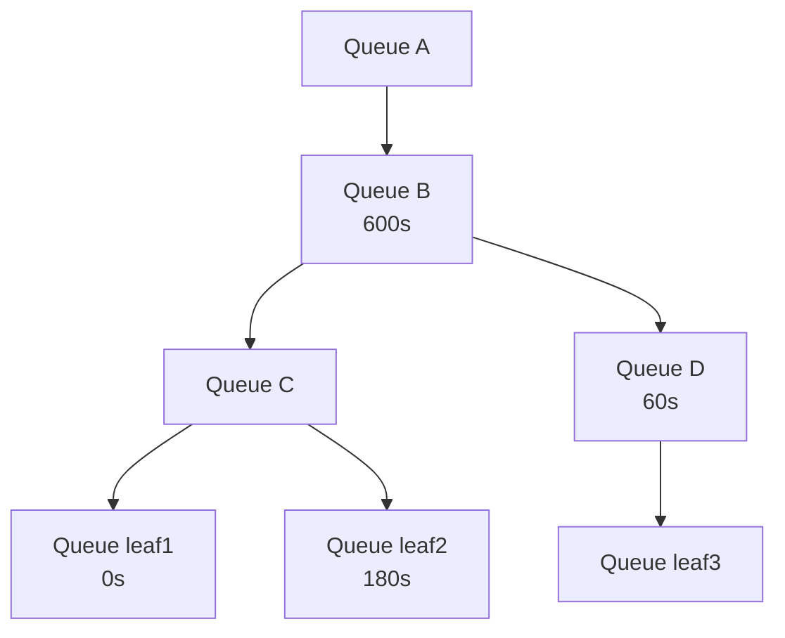
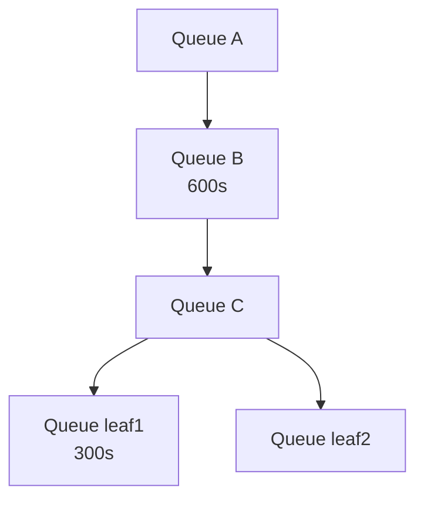

# 抢占和回收前的最短运行时间保证

## 概述

本文档提出了名为 "reclaim-min-runtime" 和 "preempt-min-runtime" 的新功能，为工作负载在发生抢占或回收之前提供可配置的运行时间保证。此功能使管理员能够在资源层次结构的各个级别定义最短运行时间保证：节点池、第 n 级队列和叶队列。

## 动机

无限制的抢占可能导致资源抖动，工作负载在取得有意义的进展之前被反复抢占。min-runtime 功能通过提供可配置的最短运行时间保证来解决此问题，这些保证可以由集群操作员设置，有时也可以在队列的某些部分内设置，以提供关于最小有用工作的保证。

## 详细设计

### 回收最短运行时间配置

reclaim-min-runtime 参数可使用以下值配置：

- **0（默认）**：工作负载始终可通过回收被抢占
- **正值**：通过回收抢占前的最短保证运行时间

### 抢占最短运行时间配置

除了使用 reclaim-min-runtime 保护工作负载免于过早被抢占外，我们还引入 preempt-min-runtime 以确保队列内抢占也受到 min-runtime 保护。

preempt-min-runtime 参数可使用以下值配置：

- **0（默认）**：工作负载始终可被同一队列中的其他工作负载抢占（受 reclaim-min-runtime 约束）
- **正值**：队列内抢占前的最短保证运行时间

### 配置层次结构

配置遵循层次化覆盖结构：

1. **节点池级别**：基础配置，如果未被队列覆盖，则应用于所有回收/抢占。默认将设置为 0，以保持始终回收/抢占的现有行为。
2. **队列级别**：覆盖节点池的回收/抢占配置，可被子队列进一步覆盖。默认将设置为未分配，导致使用节点池级别的值。

### 解析回收和抢占的适用 min-runtime

#### 回收（抢占方和受害者位于不同队列）
1. 解析抢占方和受害者叶队列之间的最近公共祖先（LCA）。
2. 向 LCA 的子节点方向下走一步，该子节点是受害者叶队列的祖先（或是叶队列本身）。
3. 使用此队列的 reclaim-min-runtime（如果已设置）。否则向树根方向回退，选择第一个可用的队列级别覆盖，或默认为节点池级别的配置值。

此算法的思路是将队列树中的 min-runtime 设置隔离为仅在回收场景中影响兄弟队列，并有可能在队列树中分配这些值的管理（例如授予用户更改树部分的权限）。
作为后续，我们还可以提供一个设置来禁用此行为，并在所有情况下始终使用叶树解析的值。在队列树中的所有 min-runtime 由单一实体管理的场景中，这可能更有利。

##### 示例

1. 抢占方在叶队列 `root.A.B.C.leaf1`、受害者在叶队列 `root.A.B.D.leaf3` 时，将使用为 `root.A.B.D` 解析的 min-runtime（60s）。

2. 抢占方在叶队列 `root.A.B.C.leaf1`、受害者在叶队列 `root.A.B.C.leaf2` 时，将使用为 `root.A.B.C.leaf2` 解析的 min-runtime（180s）。

3. 抢占方在叶队列 `root.A.B.D.leaf3`、受害者在叶队列 `root.A.B.C.leaf1` 时，将使用为 `root.A.B.C` 解析的 min-runtime（从祖先 `root.A.B` 继承的 600s）。

#### 抢占（抢占方和受害者在同一叶队列内）
从叶队列开始，沿树向上查找，直到找到第一个定义的 preempt-min-runtime 并使用该值。

##### 示例

1. `root.A.B` 有 preempt-min-runtime: 600，`root.A.B.C.leaf1` 有 preempt-min-runtime: 300。leaf1 中的工作负载将具有 preempt-min-runtime: 300。

2. `root.A.B` 有 preempt-min-runtime: 600，`root.A.B.C.leaf2` 的 preempt-min-runtime 未设置。leaf2 中的工作负载将具有 preempt-min-runtime: 600。

## 开发

### 阶段 1

通过模仿 staleTimestamp 的当前设置方式，向 PodGroup 添加 startTime：
https://github.com/NVIDIA/KAI-Scheduler/blob/420efcc17b770f30ca5b899bc3ca8969e352970a/pkg/scheduler/cache/status_updater/default_status_updater.go#L149-L154

这将是一个可读的注解，在工作负载成功分配时设置为当前时间。

出于调度目的，当 Pod 被快照时，可读时间戳会使用 https://github.com/NVIDIA/KAI-Scheduler/blob/420efcc17b770f30ca5b899bc3ca8969e352970a/pkg/scheduler/api/podgroup_info/job_info.go#L81 转换为 unix 时间戳。

对于更高级的场景，我们还可以利用调度条件，但目前已将其排除在设计提案之外。

### 阶段 2

准备 https://github.com/NVIDIA/KAI-Scheduler/blob/420efcc17b770f30ca5b899bc3ca8969e352970a/pkg/scheduler/framework/session_plugins.go 中的函数，用于从抢占/回收操作中过滤整个作业。

对于新函数，我们将对每个插件返回的值进行布尔 AND 运算，并使用该结果确定工作负载是否可被抢占。

这些函数将在每个动作的受害者选择过滤器中调用，并且仅在基于"回收"和"可抢占"的基本过滤器（例如可抢占仅与队列内工作负载相关）认为工作负载符合条件后才会调用。

https://github.com/NVIDIA/KAI-Scheduler/blob/420efcc17b770f30ca5b899bc3ca8969e352970a/pkg/scheduler/actions/preempt/preempt.go#L105-L134

https://github.com/NVIDIA/KAI-Scheduler/blob/420efcc17b770f30ca5b899bc3ca8969e352970a/pkg/scheduler/actions/reclaim/reclaim.go#L154-L158

其次，由于弹性工作负载始终可以部分抢占，我们还将暴露另一个插件钩子，允许插件定义在此处使用的自定义场景验证器：
https://github.com/NVIDIA/KAI-Scheduler/blob/7ba6bedce81b9f920f4278376eac28d6709477c7/pkg/scheduler/actions/common/solvers/job_solver.go#L33-L38

这些函数将接收 pendingJob、受害者列表以及当前场景将驱逐的当前任务，如果任何插件返回 false，则不允许该场景继续。

### 阶段 3

在节点池和队列配置中实现 (preempt|reclaim)-min-runtime 的配置选项。

对于节点池级别，`pkg/scheduler/conf/scheduler_conf.go` 似乎是适当的位置，在 `SchedulerConfiguration` 中。
https://github.com/NVIDIA/KAI-Scheduler/blob/420efcc17b770f30ca5b899bc3ca8969e352970a/pkg/scheduler/conf/scheduler_conf.go#L18-L43

由于队列定义为 CRD，额外值必须在 `pkg/apis/scheduling/v2/queue_types.go` 的 `QueueSpec` 下实现。
https://github.com/NVIDIA/KAI-Scheduler/blob/420efcc17b770f30ca5b899bc3ca8969e352970a/pkg/apis/scheduling/v2/queue_types.go#L26-L49

如果 CRD 允许，我们将使用 `time.Duration` 描述这些值，否则使用整数并以秒为单位。

建议为这些变更创建新的 v3alpha1。

### 阶段 4

实现调度器的 min-runtime 插件，扩展受害者过滤器，用于在调度器尝试执行这些操作时过滤出符合抢占条件的工作负载。我们还将扩展场景验证器，以验证和过滤出在 min-runtime 尚未过去时尝试将弹性工作负载抢占超出 MinAvailable 的场景。

我们将在过滤函数中按以下方式评估工作负载：

 1. 如果设置了 MinAvailable，始终返回 true，因为弹性工作负载由场景过滤器处理。
 2. 根据 actionType、抢占方和受害者解析正确的 min-runtime。
 3. 如果 currentTime > startTime + 解析的 min-runtime，返回 true。
 4. 否则返回 false。

为处理弹性工作负载的可抢占性（我们的插件将始终认为可抢占），我们将按以下方式操作：

当场景已解决并有一组受害者及其目标任务时，调用场景验证器函数。对于场景中的每个受害者，识别是否有弹性工作负载，如果是，则确保如果 min-runtime 尚未过去且场景执行，将至少保留 MinAvailable 个任务。
