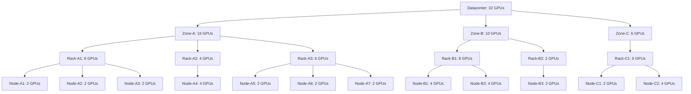

# 拓扑感知调度

## 摘要

本设计文档概述了在 KAI-Scheduler 中实现拓扑感知调度的方法，利用 Kueue 的拓扑 CRD 概念。拓扑感知通过考虑集群内资源的物理放置来实现更高效的工作负载调度，从而为受益于资源局部性的应用带来更好的性能。

## 动机

具有特定拓扑要求的工作负载，例如分布式训练作业或对节点间通信延迟敏感的应用，从尊重底层硬件拓扑的智能放置决策中受益匪浅。没有拓扑感知，作业可能被调度到物理上相距较远的节点，导致：

- 网络延迟增加和带宽降低
- 计算密集型工作负载的性能欠佳
- 集群资源利用效率低下

## 使用场景

### 更好的 Pod 间通信

具有大量 Pod 间通信的分布式工作负载将倾向于 Pod 尽可能靠近，它们之间具有最高容量和速度的网络。
如果无法在同一节点上分配它们，则在同一机架或 block 上。更重要的是能够开始运行，而不是完全满足精确的拓扑要求。

### 针对网络基础设施的高度优化

此工作负载希望确保充分利用其网络可以提供的最佳设置。
它希望将 Pod 分成将填满整个节点的组，如果可能，这些组在同一机架上，或来自同一 block 的相邻组。
然后 Pod 需要获取有关其在此内部作业拓扑中各自位置的提示。

## 目标

- 在 KAI-Scheduler 中实现拓扑感知调度
- 利用 Kueue 的拓扑 CRD 概念以保持行业标准
   - 支持层次化拓扑表示（例如 datacenter/rack/node/device）
- 提供灵活的基于拓扑的放置配置选项
- 支持 Required 和 Preferred 拓扑约束请求
- 检查比 PodAffinity Pod 组可能更多的分配：当调度器尝试调度具有多个具有 Pod 亲和性要求的 Pod 的 Pod 组时，它为第一个 Pod 找到合适的节点，然后使用该节点的标签来比较 Pod 组中下一个 Pod 的 Pod 亲和性。如果其余 Pod 无法使用该节点亲和性分配，则不会在另一个节点上尝试第一个 Pod 的分配。我们旨在解决此问题

## 非目标

- 在没有用户输入的情况下自动检测拓扑
- 改进使用 PodAffinity 的作业的分配。

## 设计细节

### 用户体验

用户将能够：

1. 在工作负载规范中定义拓扑约束
2. 定义作业可以划分为多个拓扑的方式
3. 设置拓扑感知放置的偏好——严格（仅当可以获得拓扑要求时才调度作业）或首选（尽力而为，但我更倾向于开始运行而不是等待完美设置）
4. 查看其运行工作负载的拓扑信息

### 拓扑表示

遵循 Kueue 的方法，拓扑将表示为描述集群中资源物理布局的层次结构。
我们将按原样使用 Kueue Topology CRD 或将其定义导入 KAI 调度器以简化集成并作为标准支持。

### 作业上的拓扑约束请求

pod-grouper 将在 Pod 的顶层 owner 上查找拓扑注解，并将其设置到它创建的 PodGroup 的字段上。

#### 拓扑约束的注解

为支持拓扑感知调度，我们将定义以下可添加到作业资源（例如 Job、BatchJob、MPIJob）的注解：

1. `kai.scheduler/topology-preferred-placement`：作业所有 Pod 将调度的首选拓扑级别。
2. `kai.scheduler/topology-required-placement`：作业将调度到的层次结构的最大级别。
3. `kai.scheduler/topology`：此作业将使用的拓扑 CRD 的名称（支持同一集群上的多种不同拓扑）

作业上的示例用法：
```yaml
apiVersion: batch/v1
kind: Job
metadata:
  name: topology-aware-job
  annotations:
    kai.scheduler/topology-preferred-placement: "rack"
    kai.scheduler/topology-required-placement: "zone"
    kai.scheduler/topology: "network"
```

可以仅使用 preferred 或 required 之一，但必须命名拓扑 CRD。

#### PodGroup 结构修改

为支持拓扑感知，PodGroup CRD 将使用以下字段扩展：

```go
// TopologyConstraint 定义拓扑感知调度的约束
type TopologyConstraint struct {
    // PreferredTopologyLevel 定义此约束适用的拓扑层次结构中的首选级别
    //（例如 "rack"、"zone"、"datacenter"）。
    // 作业将尽可能在此级别保持局部性进行调度。
    PreferredTopologyLevel string `json:"preferredTopologyLevel,omitempty"`

    // RequiredTopologyLevel 定义所有 Pod 必须调度在其中的拓扑层次结构中的最大级别。
    // 如果设置，作业的所有 Pod 必须调度在此级别的单个域内。
    RequiredTopologyLevel string `json:"requiredTopologyLevel,omitempty"`

    // Topology 指定定义此约束使用的物理布局的拓扑 CRD 的名称。
    // 这允许在同一集群中支持多种不同的拓扑配置。
    Topology string `json:"topology,omitempty"`
}

type PodGroupSpec struct {
    // ...现有字段...
    
    // TopologyConstraint 定义此 PodGroup 的拓扑约束
    TopologyConstraint TopologyConstraint `json:"topologyConstraints,omitempty"`
}
```

### Pod 组的假设/要求

- 所有 Pod 必须具有相同的要求和角色
    - 编排器/leader Pod 也应充当 worker 并与其余一起调度。
    - 计划在支持 Pod 组层次结构时作为问题解决。
- Pod 上没有预定义的顺序或排名。

### 实现阶段

我们将考虑两种主要实现方法：

#### 阶段 1：节点排序/过滤插件
插件将维护具有资源总和的内部拓扑树，以估计分配概率并按任务影响节点排序。

此阶段涉及：

1. 构建集群中所有拓扑层次结构的树表示
  * 此树将随模拟中完成的每次分配/抢占而更新
  * 我们需要在模拟检查点中保存和恢复它
2. 对拓扑树中每个节点的资源求和
3. 为每个作业创建也具有每个树节点中可分配 Pod 数量的拓扑树
4. 选择最适合 Pod 组的树节点的拓扑
5. 根据节点的拓扑分组对集群节点排序
6. 优先考虑为工作负载形成最内聚拓扑组的集群节点
7. 考虑以下因素：
   - 每个拓扑组内可用的资源数量
   - 树中与作业所选拓扑组的距离


##### 拓扑树结构示例：


* 从节点 NC1 到 NC2 的距离为 2，RB1 到 NA1 之间的距离为 5。
* 使用硬约束（required）时，由于节点间资源碎片化或其他调度约束，即使集群中存在解决方案，也不总能找到解决方案。
* 如果未找到树节点且拓扑约束设置为 preferred，我们将选择可以容纳最多 Pod 的树节点，并按距离对其余节点排序。
* 它将允许软/首选约束仍然确保将 Pod 调度到组的其余部分"附近"，即使所选拓扑无法容纳整个作业。
* 对于每个作业，它将自底向上计算每个树节点中可以分配的 Pod 数量，以提高精度。

#### 阶段 2：基于模拟的评估

此阶段通过迭代可能的拓扑并针对所有可用过滤器进行检查以验证分配是否成功，扩展拓扑信息在所有动作的作业分配中的使用。

1. 添加新的插件点以从插件获取可能的节点列表（类似于 "FeasibleNodesForJob" 函数，该函数也可以移至插件）。

    ```go
    FeasibleNodes(PodGroupInfo) [][]*NodeInfo
    ```

    返回列表中拓扑组的顺序应由 spread/bin packing 参数确定。

2. 迭代插件返回的所有可行节点组，每组对应不同的建议拓扑，应适合作业并尝试在那里分配作业。

* 在大型集群中预计会有显著的性能下降，因为这可能导致尝试许多由于缺少 DRA/Volume 或其他条件而无法真正运行作业的拓扑。另一方面，仅第一阶段无法为这些作业找到正确的分配。


#### Topology Info 结构

两种方法都需要构建拓扑树，并随调度器在 session 和模拟期间所做的更改而更新它。
我们将在集群 session 启动阶段读取 Topology 资源，并创建将在整个 session 中随每次更改维护的 TopologyInfo 结构。

```go
// TopologyDomainID 唯一标识拓扑域
type TopologyDomainID string

// TopologyInfo 表示集群的拓扑树
type TopologyInfo struct {
    // 拓扑树的根
    Root *TopologyDomainInfo

    // 按 ID 的所有域的映射，用于快速查找
    Domains map[TopologyDomainID]*TopologyDomainInfo

    // 此拓扑配置的名称
    Name string
}

// TopologyDomainInfo 表示拓扑树中的节点
type TopologyDomainInfo struct {
    // 此域的唯一 ID
    ID TopologyDomainID

    // 此域的名称
    Name string

    // 层次结构中的级别（例如 "datacenter"、"zone"、"rack"、"node"）
    Level string

    // 父域，根为 nil
    Parent *TopologyDomainInfo

    // 子域
    Children []*TopologyDomainInfo

    // 属于此域的节点
    Nodes map[string]*node_info.NodeInfo

    // 此域中的总可用资源
    AvailableResources v1.ResourceList

    // 此域中的总已分配资源
    AllocatedResources v1.ResourceList

    // 此域中可以分配的 Pod 数量
    AllocatablePods int

    // 此树为其构建的作业中每个 Pod 请求的资源列表
    RequestedResources v1.ResourceList

    // 树中距根的深度（根为 0）
    Depth int
}
```

此结构将在专用拓扑插件中构建和更新。

#### 拓扑感知插件

##### 设置
使用 Allocate/Deallocate 事件处理器维护具有可用资源的所有拓扑树（类似于 dynamicresources 插件）

##### 预处理
* 注册 PrePredicate 函数以创建作业特定的树，根据作业中每个 Pod 请求的资源为每个树节点填充可分配 Pod 数量。
  * 考虑将名称更改为 PreFilter 或 PreProcess
* 使用此数据，我们可以为作业选择最佳拓扑（由树节点表示）。
* 当有多个拓扑可用时，我们可以选择最适合 bin packing 或 spreading 的拓扑（例如，如果请求了 bin packing，则获取资源最少的拓扑）
* 每作业预处理的树将从插件维护的基础树构建。
* 我们将在此使用所有 Pod 具有相同资源要求的假设，使用后序遍历计算每个树节点中可以分配的 Pod 数量。

#### 节点排序和过滤
- 这目前按任务调用，因此使用当前设置，它必须在插件中缓存结果（可能还使用资源树哈希？）
- 在树中搜索作业的最佳分配并保存以供下一次 Predicate 和 NodeOrder 调用使用。
    - Predicate 函数将仅用于严格的拓扑感知调度。
- NodeOrder 将所选节点排在所有其他节点之上，然后按距离对其他节点排序。使用将使此插件比任何其他插件更占主导地位的因素（类似于 pod affinity node order）。
- 对于未来扩展：`BeforeBind` 的新插件点将允许变更 bind request / 创建 bind request 的 pod。它将用于向 Pod 添加 rank 标签，以指定其在作业中所选的 rank。

### Pod Grouper 实现

pod-grouper 组件将增强以：

1. 在 Pod 的顶层 owner 上查找拓扑相关注解
2. 提取和验证拓扑约束信息
3. 在它创建的 PodGroup 中设置相应字段
4. 支持 Required 和 Preferred 约束

## 可能的扩展
我们可以扩展建议的实现，以支持将作业分段为 block（类似于 SLURM 的 topology/block 插件），或通过搜索在内部拓扑树中分配整个子树来支持 Pod 组层次结构（具有 SuperPodGroup 等新概念）。

## 实现计划

实现将分阶段进行：

1. 基本拓扑表示和 Kueue Topology CRD 集成
2. Pod Grouper 和 Pod Group 变更
2. 实现 TopologyInfo 并使用当前 Pod 分配和模拟更新其资源。
3. 在拓扑插件中实现方法 1（可以是步骤 2 中的同一插件。）


## 考虑的替代方案

- 使用现有 Kubernetes 拓扑机制，如 topology spread constraints、pod affinity

这些替代方案被考虑但被拒绝，因为偏离了最终用户已经知道和期望的做法，以及需要创建更限制性的东西以允许算法更简单。

## 参考

- KAI-Scheduler issue #66: Topology Aware Scheduling
- [Kueue Topology CRD 文档](https://kueue.sigs.k8s.io/docs/concepts/topology_aware_scheduling/)
