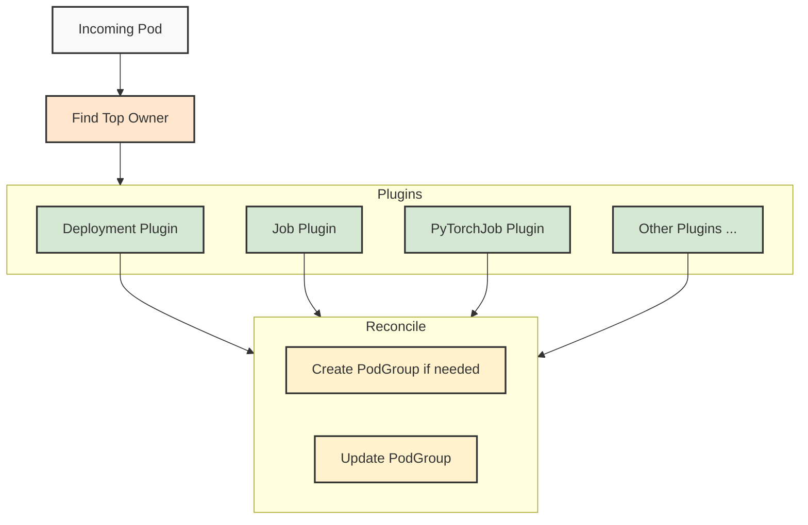

# Pod Grouper

## 概述
Pod Grouper 是一个组件，负责根据传入的 Pod 自动创建和管理 PodGroup 资源。它采用基于插件的架构，以支持针对不同工作负载类型的各种分组策略。Pod Grouper 的核心功能是确保属于同一逻辑工作负载的 Pod 能够正确分组，以实现 gang 调度目的。

### 背景：Gang 调度
Gang 调度是一种调度策略，其中一组相关的 Pod 必须一起调度或全部不调度。这对于分布式工作负载至关重要，例如：

- 需要多个 worker 同时启动的机器学习训练作业
- 需要所有组件可用的分布式数据处理任务
- 需要所有进程同步启动的 HPC 应用

没有 gang 调度，单个 Pod 可能在不同时间被调度，导致资源效率低下、死锁或应用失败。

## PodGroup CRD
Pod Grouper 使用 PodGroup 自定义资源定义（CRD）来表示应一起调度的一组相关 Pod。此 CRD 包括：

- `MinMember`：必须一起调度的最小 Pod 数量
- `Queue`：工作负载所属的队列
- 调度和资源状态信息
- 组生命周期的阶段和条件跟踪

虽然用户或第三方工具可以手动创建 PodGroup 资源，但 Pod Grouper 通过分析传入的 Pod 并根据 Pod 的特征和所有权应用适当的分组逻辑来自动化此过程。

## 插件架构
Pod Grouper 使用与调度器插件框架类似的基于插件的架构。每个插件为不同类型的工作负载实现特定的分组逻辑：



### 顶层所有者识别
Pod Grouper 通过遍历 Pod 的 owner references 来识别每个 Pod 的最高层所有者。这使系统能够：

1. 将属于同一父工作负载的 Pod 分组
2. 根据父工作负载类型应用一致的分组逻辑
3. 处理复杂的所有权层次结构（例如，由 Deployment 拥有的 ReplicaSet）

例如，由作为 Deployment 一部分的 ReplicaSet 创建的 Pod 将根据 Deployment 的特征而不是 ReplicaSet 的特征进行分组。

#### 跳过顶层所有者
在某些情况下，顶层所有者可能不是分组的适当级别。Pod Grouper 支持“跳过顶层所有者”模式，其中使用第二高层所有者进行分组。这适用于：
* 多层部署
* 委托给标准 Kubernetes 资源的自定义控制器
* 顶层所有者不包含相关调度信息的情况

例如，对于 Argo Workflows，pod-grouper 不使用最顶层的 Argo Workflow 作为分组键。如果 Argo Workflow 创建了 PyTorch 作业，pod-grouper 将根据 PyTorch 作业规范而不是 Argo Workflow 对 Pod 进行分组。这确保了 specialized 工作负载在通过工作流编排系统启动时也能保持其适当的 gang 调度特征。
这种“透视”编排层的能力使 pod-grouper 能够在不同的部署方法中保持一致的分组逻辑，无论作业是直接创建还是通过自动化工具创建。

## 分组逻辑示例

### Job/BatchJob 分组
对于 Job 资源，Pod Grouper：
- 创建与 Job 身份匹配的 PodGroup
- 默认将 MinMember 设置为 1——原生 k8s 批处理作业通常不需要 gang 调度
- 将 PodGroup 的优先级类设置为 "Train"，以允许其超出配额

### Deployment 分组
Deployment 是特殊情况：
- 为 deployment 的每个 Pod 创建一个 Pod Group
- Deployment 的默认优先级类为 "Inference"，因为这是它们的常见用例

### MPI Job 分组
对于 MPI 工作负载：
- 从 schedulingPolicy.minAvailable 推断 gang 调度要求，否则使用所有副本
- 默认使用 "Train" 优先级类

### Pod 分组
对于没有 owner 的 Pod，创建一个 MinMember=1 的 "Train" 优先级 PodGroup。

### 覆盖默认优先级类
虽然优先级类是从工作负载类型推断的，但通常可以通过使用标签覆盖此默认值：在顶层所有者或 Pod 本身上添加 `priorityClassName` 将覆盖工作负载使用的任何默认值。

## PodGroup CRD 文档

PodGroup CRD 包括以下关键字段：

### Spec 字段
- `minMember`：调度所需的最小 Pod 数量
- `queue`：资源分配的队列名称
- `priorityClassName`：PodGroup 的优先级
- `markUnschedulable`：在调度尝试失败后是否将 Pod 标记为不可调度
- `schedulingBackoff`：在将 podgroup 标记为不可调度之前的周期数。目前仅支持 1 或 -1（无退避）

### 不可调度说明
PodGroup CRD 在作业无法调度时包含详细说明，包括：
- 资源配额详情
- 队列限制和使用情况
- 请求与可用资源
- 可抢占与不可抢占资源信息

这种结构化信息帮助用户和自动化系统理解和响应调度失败。
 ## 示例插件

``` Go
// CustomJobPodGroupPlugin 为自定义作业资源实现分组逻辑

type CustomJobPodGrouper struct {
	*defaultgrouper.DefaultGrouper
}

func NewCustomJobGrouper(defaultGrouper *defaultgrouper.DefaultGrouper) *CustomJobPodGrouper {
	return &CustomJobPodGrouper{
		defaultGrouper,
	}
}

func (cjg *CustomJobPodGrouper) Name() string {
	return "Custom Job Grouper"
}

func (cjg *CustomJobPodGrouper) CustomJobPodGroupMetadata(
	topOwner *unstructured.Unstructured, pod *v1.Pod, otherOwners ...*metav1.PartialObjectMetadata,
) (*podgroup.Metadata, error) {
	// 使用默认实现获取默认元数据很有用，
	// 然后覆盖自定义作业特定的字段。
	podGroupMetadata, err := cjg.DefaultGrouper.GetPodGroupMetadata(topOwner, pod)
	if err != nil {
		return nil, err
	}

	// 如果存在，从 spec 中提取 minAvailable
	minAvailable, found, err := unstructured.NestedInt64(topOwner.Object, "spec", "minAvailable")
	if err != nil {
		return nil, fmt.Errorf("error extracting minAvailable from spec: %w", err)
	}

	// 如果找到 minAvailable，覆盖 minMember
	if found && minAvailable > 0 {
		podGroupMetadata.MinAvailable = int32(minAvailable)
		return podGroupMetadata, nil
	}

	// 如果未设置 minAvailable，回退到 replicas 字段
	replicas, found, err := unstructured.NestedInt64(topOwner.Object, "spec", "replicas")
	if err != nil {
		return nil, fmt.Errorf("error extracting replicas from spec: %w", err)
	}

	if found && replicas > 0 {
		podGroupMetadata.MinAvailable = int32(replicas)
		return podGroupMetadata, nil
	}

	// 否则保留默认实现中的默认 minMember
	return podGroupMetadata, nil
}
```

要注册您的插件，请编辑 `pkg/podgrouper/podgrouper/hub/hub.go` 并在 supportedTypes 切片中添加以下条目：
``` Go 
defaultGrouper := defaultgrouper.NewDefaultGrouper(queueLabelKey)
table := supportedTypes{
    {
        Group:   "example.com",
        Version: "v1",
        Kind:    "CustomJob",
    }: customjob.NewCustomJobGrouper(defaultGrouper),
    ...
}
```
