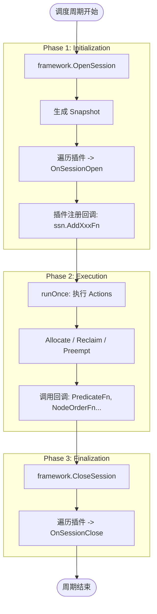

# 插件框架走读

本文梳理 KAI Scheduler 的**插件机制**：插件如何注册、何时加载、以及各类扩展点在调度流程中的调用时机。

参考文档：`docs/developer/plugin-framework-zh.md`、`docs/developer/scheduler-concepts-zh.md`。

---

## 1. 插件生命周期概览

插件生命周期紧密跟随调度周期（Scheduling Cycle）。

> **[Design: Plugin Framework]** 插件的三阶段生命周期：
>
> 1. **Initialization (Observation & Registration)**: 在 Session 打开时，插件观察集群状态（Snapshot），并注册各种回调函数（"我关心什么"）。
> 2. **Execution (Invocation)**: 在 Actions 执行过程中，调度器调用已注册的回调（"执行我的逻辑"）。
> 3. **Finalization (Cleanup)**: Session 关闭时，插件清理资源或上报指标。



### 1.1 关键代码流程

```
framework.OpenSession(cache, config, ...)
    │
    ├─ openSession：从 Cache 生成 Snapshot，填充 Session
    │
    └─ [Design: Initialization] 插件注册
            for tier in config.Tiers:
                for pluginOption in tier.Plugins:
                    plugin = GetPluginBuilder(pluginOption.Name)(pluginOption.Arguments)
                    plugin.OnSessionOpen(ssn)   ← 插件在此注册 Predicate/Order 等函数
    │
    ▼
runOnce：执行 Actions（Allocate、Reclaim、Preempt 等）
    │
    └─ [Design: Execution] 回调调用
          各 Action 内部调用 Session 方法，触发插件逻辑：
          - ssn.PredicateFn(...)      → 决定节点是否可用
          - ssn.NodeOrderFn(...)      → 决定节点打分
          - ssn.CanReclaimResources(...) → 决定是否回收
    │
    ▼
framework.CloseSession(ssn)
    │
    └─ [Design: Finalization] 资源清理
            for plugin in ssn.plugins:
                plugin.OnSessionClose(ssn)
```

---

## 2. 插件接口与注册

### 2.1 插件接口

```go
type Plugin interface {
	Name() string
	OnSessionOpen(ssn *Session)
	OnSessionClose(ssn *Session)
}
```

### 2.2 注册方式

```go
type PluginBuilder func(args map[string]string) Plugin

// 在 plugins.InitDefaultPlugins() 中注册
framework.RegisterPluginBuilder("predicates", predicates.New)
framework.RegisterPluginBuilder("proportion", proportion.New)
// ...
```

配置文件（`--scheduler-conf`）中的 `tiers` 指定要加载的插件及参数：

```yaml
tiers:
  - plugins:
      - name: predicates
      - name: proportion
        arguments:
          # ...
```

### 2.3 加载流程（OpenSession）

文件：`pkg/scheduler/framework/framework.go`

```go
for _, tier := range config.Tiers {
	for _, pluginOption := range tier.Plugins {
		pb, found := GetPluginBuilder(pluginOption.Name)
		plugin := pb(pluginOption.Arguments)
		ssn.plugins[plugin.Name()] = plugin
		plugin.OnSessionOpen(ssn)
	}
}
```

每个插件在 `OnSessionOpen` 中通过 `ssn.AddXxxFn(...)` 注册回调。

---

## 3. 扩展点分类

### 3.1 调度顺序（Order）

| 扩展点               | 类型             | 调用时机                 | 作用          |
| -------------------- | ---------------- | ------------------------ | ------------- |
| `QueueOrderFn`       | `CompareQueueFn` | JobsOrderByQueues 选队列 | 队列优先级    |
| `JobOrderFn`         | `CompareFn`      | 队列内选 Job             | Job 优先级    |
| `PodSetOrderFn`      | `CompareFn`      | SubGroup 内选 PodSet     | PodSet 顺序   |
| `SubGroupSetOrderFn` | `CompareFn`      | SubGroupSet 内选子组     | SubGroup 顺序 |
| `TaskOrderFn`        | `CompareFn`      | PodSet 内选 Task         | Task 顺序     |

### 3.2 节点选择（Predicate & Score）

| 扩展点           | 类型                                        | 调用时机                           | 作用                 |
| ---------------- | ------------------------------------------- | ---------------------------------- | -------------------- |
| `PrePredicateFn` | `func(task, job) error`                     | allocateTask 前                    | 快速预检查           |
| `PredicateFn`    | `func(task, job, node) error`               | FittingNode 内                     | 节点是否可调度       |
| `NodeOrderFn`    | `func(task, node) (float64, error)`         | OrderedNodesByTask 内              | 节点评分             |
| `NodePreOrderFn` | `func(task, fittingNodes)`                  | 节点排序前                         | 预排序               |
| `GpuOrderFn`     | `func(task, node, gpuIdx) (float64, error)` | 分式 GPU 选 GPU 时                 | GPU 评分             |
| `SubsetNodesFn`  | `func(...) ([]NodeSet, error)`              | allocateSubGroupSet/allocatePodSet | 节点集划分（拓扑等） |

### 3.3 队列与公平（Reclaim / Preempt）

| 扩展点                                | 类型                           | 调用时机          | 作用           |
| ------------------------------------- | ------------------------------ | ----------------- | -------------- |
| `CanReclaimResourcesFn`               | `func(reclaimer) bool`         | Reclaim 前        | 是否允许回收   |
| `ReclaimVictimFilter`                 | `func(reclaimer, victim) bool` | Reclaim 选 Victim | Victim 过滤    |
| `ReclaimScenarioValidatorFn`          | `func(scenario) bool`          | Reclaim 解校验    | 解是否合法     |
| `PreemptVictimFilter`                 | `func(preemptor, victim) bool` | Preempt 选 Victim | Victim 过滤    |
| `PreemptScenarioValidator`            | `func(scenario) bool`          | Preempt 解校验    | 解是否合法     |
| `IsJobOverQueueCapacityFn`            | `func(job, tasks) Result`      | Allocate 前       | 队列配额       |
| `IsNonPreemptibleJobOverQueueQuotaFn` | `func(job, tasks) Result`      | Preempt 前        | 抢占后队列配额 |

### 3.4 其他

| 扩展点                                        | 类型                                    | 调用时机            | 作用                         |
| --------------------------------------------- | --------------------------------------- | ------------------- | ---------------------------- |
| `BindRequestMutateFn`                         | `func(pod, nodeName) map[string]string` | 创建 BindRequest 前 | 修改 BindRequest Annotations |
| `PreJobAllocationFn`                          | `func(job)`                             | AllocateJob 前      | Job 级预处理                 |
| `EventHandler` (AllocateFunc, DeallocateFunc) | 事件回调                                | Allocate/Evict 时   | 状态跟踪                     |
| `GetQueueAllocatedResourcesFn` 等             | 队列资源                                | proportion 等       | 公平份额计算                 |

---

## 4. 调用链示例：Allocate 中的插件调用

以 `allocateTask`（`actions/common/allocate.go`）为例：

```go
func allocateTask(ssn *framework.Session, stmt *framework.Statement, nodes []*node_info.NodeInfo,
	task *pod_info.PodInfo, isPipelineOnly bool) bool {
	// 1. PrePredicateFn
	err := ssn.PrePredicateFn(task, job)
	if err != nil { return false }

	// 2. OrderedNodesByTask：聚合各插件的 NodeOrderFn 对节点排序
	orderedNodes := ssn.OrderedNodesByTask(nodes, task)

	for _, node := range orderedNodes {
		// 3. FittingNode：执行 PredicateFn，检查是否可调度
		if !ssn.FittingNode(task, node, !isPipelineOnly) {
			continue
		}
		success = allocateTaskToNode(ssn, stmt, task, node, isPipelineOnly)
		if success { break }
	}
	return success
}
```

### 4.1 OrderedNodesByTask

```go
func (ssn *Session) OrderedNodesByTask(nodes []*node_info.NodeInfo, task *pod_info.PodInfo) []*node_info.NodeInfo {
	nodeScores := make(map[float64][]*node_info.NodeInfo)
	for _, node := range nodes {
		score := float64(0)
		for _, nodeOrderFn := range ssn.NodeOrderFns {
			pluginScore, _ := nodeOrderFn(task, node)
			score += pluginScore
		}
		nodeScores[score] = append(nodeScores[score], node)
	}
	// 按 score 降序排序后返回
	// ...
}
```

**各插件 NodeOrderFn 的分数会累加**，分数越高越优先。

### 4.2 FittingNode

```go
func (ssn *Session) FittingNode(task *pod_info.PodInfo, node *node_info.NodeInfo, writeFittingDelta bool) bool {
	for _, pfn := range ssn.PredicateFns {
		err := pfn(task, job, node)
		if err != nil {
			return false
		}
	}
	return true
}
```

**任一 PredicateFn 返回错误则节点不可调度**。

---

## 5. 典型插件示例

### 5.1 predicates

```go
func (pp *predicatesPlugin) OnSessionOpen(ssn *framework.Session) {
	ssn.AddPredicateFn(func(task, job, node) error {
		// 资源检查、节点亲和性、污点容忍等
		// ...
	})
}
```

### 5.2 proportion

```go
func (pp *proportionPlugin) OnSessionOpen(ssn *framework.Session) {
	ssn.AddQueueOrderFn(pp.queueOrder)
	ssn.AddCanReclaimResourcesFn(pp.CanReclaimResourcesFn)
	ssn.AddReclaimScenarioValidatorFn(pp.reclaimableFn)
	ssn.AddIsJobOverQueueCapacityFn(...)
	ssn.AddIsNonPreemptibleJobOverQueueQuotaFn(...)
	// ...
}
```

### 5.3 topology

```go
func (t *topologyPlugin) OnSessionOpen(ssn *framework.Session) {
	ssn.AddSubsetNodesFn(t.subsetNodesFn)  // 拓扑划分 NodeSet
	ssn.AddNodeOrderFn(t.nodeOrderFn)       // 拓扑评分
}
```

### 5.4 内置插件列表（factory.go）

| 类别      | 插件                                              | 主要扩展点                             |
| --------- | ------------------------------------------------- | -------------------------------------- |
| 谓词/评分 | predicates, nodeplacement, nodeavailability       | PredicateFn, NodeOrderFn               |
| GPU       | gpusharingorder, gpupack, gpuspread, resourcetype | NodeOrderFn, GpuOrderFn                |
| 调度顺序  | taskorder, subgrouporder, reflectjoborder         | TaskOrderFn, PodSetOrderFn, JobOrderFn |
| 队列      | proportion, minruntime                            | QueueOrderFn, Reclaim/Preempt 相关     |
| 拓扑/亲和 | topology, podaffinity                             | SubsetNodesFn, NodeOrderFn             |
| 其他      | dynamicresources, elastic, snapshot               | 多种                                   |

---

## 6. 回调聚合规则

### 6.1 顺序类（CompareFn）

- `JobOrderFn`、`TaskOrderFn` 等：按注册顺序依次调用，第一个返回非 0 的结果即采用。
- 若全部返回 0，则按默认规则（CreationTimestamp、UID）排序。

### 6.2 谓词类（PredicateFn）

- 任一返回错误则整体失败。

### 6.3 评分类（NodeOrderFn）

- 各插件分数**累加**，总分越高越优先。

### 6.4 节点集类（SubsetNodesFn）

- 各插件**依次**对当前 NodeSet 列表做划分，形成树状展开。
- 例如：插件 P 将 [A,B,C] 分为 [A,B] 和 [C]，插件 R 再对 [A,B] 分为 [A] 和 [B]，最终尝试 [A]、[B]、[C]。

---

## 7. 小结：插件框架要点

| 项目       | 说明                                                              |
| ---------- | ----------------------------------------------------------------- |
| 生命周期   | OnSessionOpen（每周期）→ 回调注册 → Actions 执行 → OnSessionClose |
| 配置来源   | scheduler-conf 的 tiers.plugins                                   |
| 注册方式   | PluginBuilder + RegisterPluginBuilder                             |
| 调用方     | Session 的聚合方法（QueueOrderFn、PredicateFn、NodeOrderFn 等）   |
| 扩展点数量 | 20+ 种，覆盖顺序、谓词、评分、队列、Reclaim/Preempt 等            |

理解插件框架后，可据此实现自定义调度策略（如新评分规则、新 Victim 过滤条件等）。
